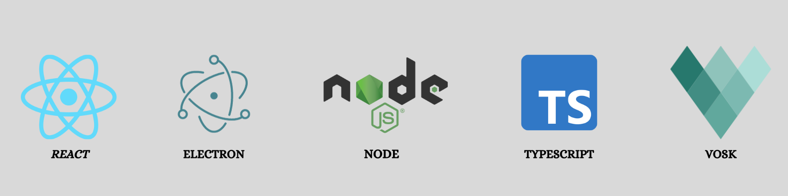
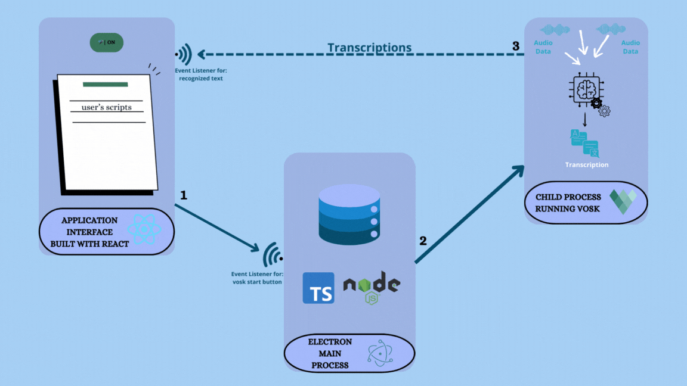

# smart-teleprompter 💬🎥

***
**_`السَّلامُ عَلَيْكُم ورَحْمَةُ اللهِ وَبَرَكاتُهُ`_** <br/>
**_`Peace be upon you and the mercy of Allah and His blessings`_** <br/>

## Introduction

Imagine delivering a presentation, recording a video, or even holding a live stream, all while maintaining natural eye
contact and smooth delivery – without memorizing a single word.

That's the power of a teleprompter, and with this
innovative project, you can experience its benefits without breaking the bank or needing fancy equipment.

Say goodbye to expensive rigs and hello to a smarter prompting solution:

* **Affordable and accessible:** Forget about hefty price tags. This project brings teleprompting within reach for
  everyone, from aspiring YouTubers to seasoned professionals.
* **Camera-agnostic:** Ditch the limitations of traditional setups. This solution works seamlessly with any camera, even
  your laptop's built-in lens, giving you ultimate flexibility.
* **Read with ease:** Upload your script and watch it scroll smoothly on the screen, perfectly paced for your speaking
  rhythm. Maintain flawless eye contact with your audience, fostering a more natural and engaging connection.

## Overview

A teleprompter serves as an invaluable tool for speakers during television or video production, allowing them to
seamlessly deliver scripted content while maintaining eye contact with their audience or camera. <br>

However, traditional teleprompters can be prohibitively expensive and may not be accessible to everyone, particularly
when lacking a
professional camera setup. <br>

To address this challenge, I've developed this **solution** that simulates a real teleprompter, providing users
with a user-friendly platform to upload their scripts. <br>
The script is then displayed on the screen, enabling users to effortlessly read it while staying focused on the camera.

This project is not just a tool, it's an empowering platform for:

* **Public speakers**: Deliver impactful presentations with confidence and clarity.
* **Content creators**: Elevate your video productions to a professional level.
* **Educators**: Create engaging online courses and lectures.
* **Anyone who wants to communicate effectively**: From live streams to video meetings, this solution empowers you to
  connect with your audience on a deeper level.

## Technologies Used

Those are the main technologies used in this project:


## Architecture



1. After uploading a script, the user initiates the process by clicking the "Start" button.
2. The main process launches a child process to run Vosk, triggered by an event listener for the click.
3. Vosk transcribes audio from the microphone, sending the results to the renderer process. <br>
   The renderer process, equipped with an event listener, then compares the transcribed text with the uploaded script.

## Installation

1. Make sure to have Node.js installed on your machine
   You can install it using this link here [https://nodejs.org/en/download/](https://nodejs.org/en/download/)

2. Clone the repo from github using the following command
   ```sh
   git clone https://github.com/NidhalNaffati/smart-teleprompter.git
   ```
3. Install NPM packages
   ```sh
    cd smart-teleprompter && npm install
    ```
4. Install the Vosk model you want to use
   from [https://alphacephei.com/vosk/models](https://alphacephei.com/vosk/models)
5. Make sure to extract the model in the root directory of the project and rename it to `model`

## Usage

1. With in the `SpeechToTextAnalyzer` file in the `src/components` folder change the script that you want to read 📜 <br>
   **Note**: Within the `SpeechToTextAnalyzer` make sure to use `\n` to indicate to separate paragraphs
   Here is an example of a script:
    ```typescript
    const referenceText: string =
    'Hello, my name is Nidhal Naffati. \n' +
    'I am a software engineer\n' +
    'I am passionate about building software that helps people and solves real world problems.';
    ```
2. Run the application with the following command
   ```sh
   npm run dev
   ```
3. Click on the start button to start the process
4. Start reading the script and the application will highlight the words that you are reading